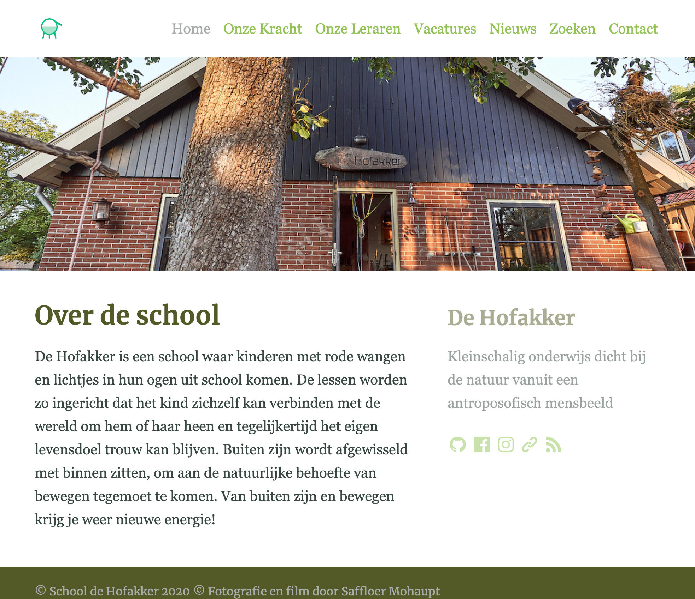
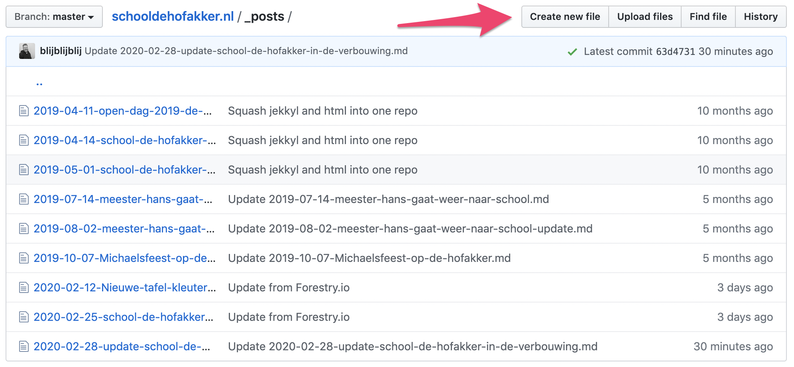
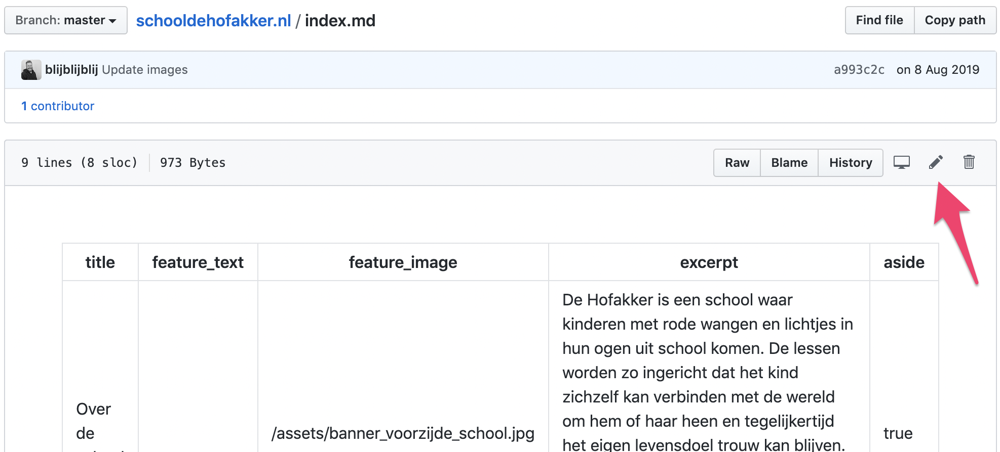
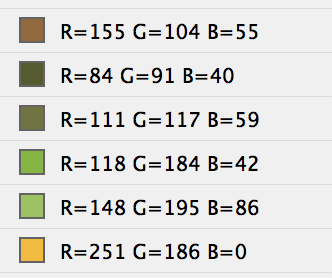

[](https://github.com/schooldehofakker/schooldehofakker.nl/issues)
[](https://github.com/schooldehofakker/schooldehofakker.nl/network)
[](https://github.com/schooldehofakker/schooldehofakker.nl/stargazers)
[](https://github.com/schooldehofakker/schooldehofakker.nl/blob/master/LICENSE)

# schooldehofakker.nl

Publieke website van [School de Hofakker](https://schooldehofakker.nl)

## beheren van de website

Deze website is gemaakt met een statische website generator genaamd [jekyll](https://jekyllrb.com/). Dit klinkt
spannender dan het is, wat een generator doet is simpele tekst bestanden geschreven in een bepaald formaat 
((markdown)[https://guides.github.com/features/mastering-markdown/]) omzetten in html, de structuur waar alle 
websites op het internet op gebouwd zijn.

Hier een voorbeeld van de voorpagina van de Hofakker:

```
    ---
    title: Over de school
    feature_text: |
    feature_image: "/assets/banner_voorzijde_school.jpg"
    excerpt: "De Hofakker is een school waar kinderen met rode wangen en lichtjes in hun ogen uit school komen. De lessen worden zo ingericht dat het kind zichzelf kan verbinden met de wereld om hem of haar heen en tegelijkertijd het eigen levensdoel trouw kan blijven. Buiten zijn wordt afgewisseld met binnen zitten, om aan de natuurlijke behoefte van bewegen tegemoet te komen. Van buiten zijn en bewegen krijg je weer nieuwe energie! "
    aside: true
    ---
    De Hofakker is een school waar kinderen met rode wangen en lichtjes in hun ogen uit school komen. De lessen worden zo ingericht dat het kind zichzelf kan verbinden met de wereld om hem of haar heen en tegelijkertijd het eigen levensdoel trouw kan blijven. Buiten zijn wordt afgewisseld met binnen zitten, om aan de natuurlijke behoefte van bewegen tegemoet te komen. Van buiten zijn en bewegen krijg je weer nieuwe energie!
```

De generator kan dan die tekst omzetten in:



Het genereren en omzetten is geautomatiseerd, en gebeurt [automatisch bij iedere wijziging](https://github.com/schooldehofakker/schooldehofakker.nl/actions) 
die opgeslagen wordt via dit [configuratie bestand](https://github.com/schooldehofakker/schooldehofakker.nl/blob/master/.github/workflows/main.yml).

Pagina's kunnen op verschillende manieren bewerkt worden:

### Optie 1, via github.com

door een nieuw bestand te maken:



of door een bestaand bestand te bewerken:



Dit kan lastig zijn, en is niet voor iedereen weggelegd, daarom is het handiger om een Content Management Tool te gebruiken:

### Optie 2, via een Content Management tool: Forestry.io

Forestry is een tool die de bestanden van de website kan inlezen en daar een grafische schil omheen kan maken 
waardoor je direct vanuit de browser content wijzigingen kan doorvoeren, maar zonder aan de misschien complexere 
Markdown of structuur van de site blootgesteld te worden.

Om met Forestry aan de slag te gaan moet eerst inloggen op [https://app.forestry.io/login](https://app.forestry.io/login).
Gebruik daarvoor je github inlog:


## Het kleurenpalet


