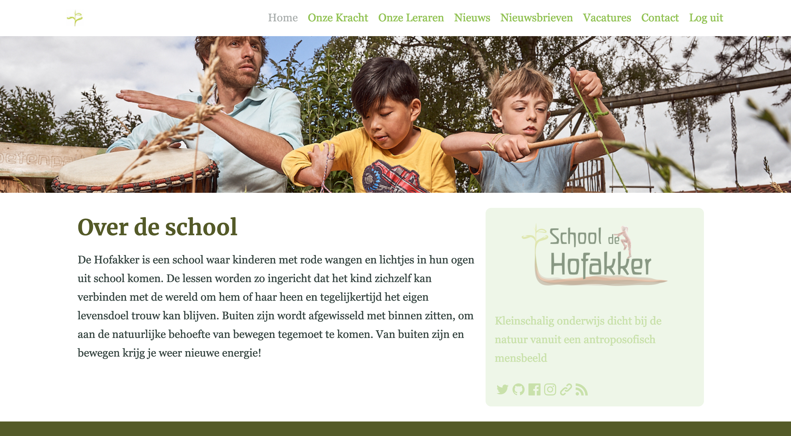

# schooldehofakker.nl

Publieke website van School de Hofakker




[](https://github.com/schooldehofakker/schooldehofakker.nl/issues)
[](https://dependabot.com) <a href="https://www.ruby-lang.org/en/">  </a> <a href="http://rubyonrails.org/">  </a>

## Data model


## Getting started

*   Install [dip](https://github.com/bibendi/dip)
*   Install [docker](https://docs.docker.com/install/)
*   Install [docker-compose](https://docs.docker.com/compose/install/)

## Contributing

We encourage you to contribute to schooldehofakker.nl! Please check out the
[Contributing to schooldehofakker guide](CONTRIBUTING.md) for guidelines about how to proceed.

## Checkout the code

```shell
git clone https://github.com/schooldehofakker/schooldehofakker.nl.git
cd schooldehofakker.nl
dip provision
dip rails s
dip rubocop
dip rspec
```

## Deploy

Once you're ready to deploy to [Heroku](https://www.heroku.com), run:

```shell
heroku apps:create
heroku buildpacks:add heroku/ruby --index 2
git push heroku master
heroku run rake db:seed
heroku open
```

Or you can click this button to deploy straight to Heroku from this repository:

[](https://heroku.com/deploy)

Success, live long and prosper!

## Suggestions, problems, typos?

Get in touch by adding an [issue](https://github.com/schooldehofakker/schooldehofakker.nl/issues).
